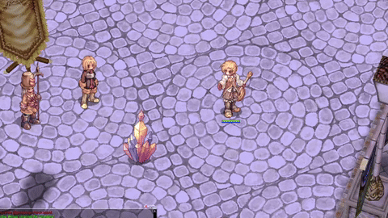

# HERCULES/HERACLES PLUGIN

## Mimic animations
Use server side fake packets to force the client to display attack-like animations to mimic the previous behavior of skills such as AS_SONICBLOW, which were removed in 2018+ clients.

> [!WARNING]
> As this plugin uses fake packets tightly tied to small timers, the user experience may not be ideal if the user connectivity is of bad quality.

## Animations showcase

#### Sonic blow

#### Vulcan Arrow
